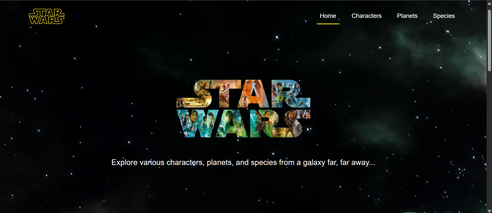

# Star Wars Explorer

A simple React web application for exploring Star Wars data using the SWAPI (Star Wars API). Users can view characters, planets, and species from the Star Wars universe.

## Features
- Home page with hero section and featured saga carousel.
- Characters page with search and paginated grid of characters.
- Planets page with a large planet carousel.
- Species page with circular species cards and pagination.
- Responsive layout and basic loading/error handling for API requests.

## Technologies Used
- JavaScript
- React
- Bootstrap
- CSS
- SWAPI

## Installation

1. **Clone the repository**:
   ```bash
   git clone https://github.com/arianz/starwars-explorer.git
   ```
2. Navigate to the project directory:
   ```bash
   cd starwars-explorer
   ```
3. Ensure you have Node.js installed, then install dependencies:
   ```bash
   npm install
   ```
4. Start the development server:
   ```bash
   npm start
   ```
5. Open http://localhost:3000 in your browser.

## Screenshots
|          App Interface - Desktop         |          App Interface - Mobile          |
|------------------------------------------|------------------------------------------|
|  |  |
